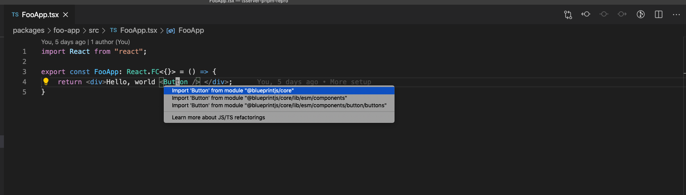
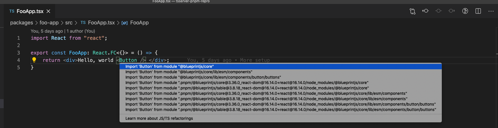

# tsserver-pnpm-repro

Simple repro for a potential performance issue with tsserver and PNPM. See [typescript#40584](https://github.com/microsoft/TypeScript/issues/40584).

## Yarn
```
git clean -dfx && yarn
```




## PNPM
```
git clean -dfx && pnpm install
```



